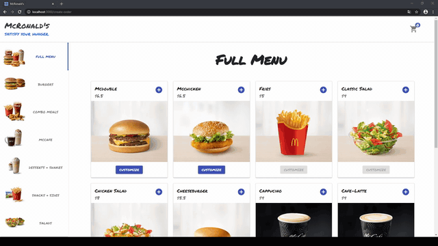
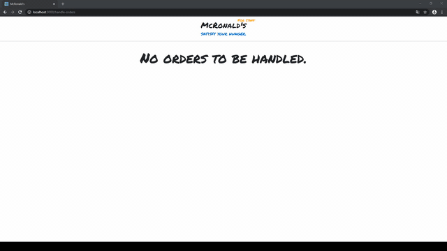

# McRonald's

McRonald’s to system - kiosk do obsługi zamówień dla sieci gastronomicznej. System został zaprojektowany na specjalny komputer - kiosk, w którym będziemy mieć możliwość zamówienia interesujących nas produktów, za których płatność możemy dokonać w kasie sieci sklepów..
Na poniższym gifie możemy zaobserwować cały proces zamawiania produktów. Gdy klikniemy w poszczególny produkt, naszym oczom ukażą się szczegóły, takie jak ilość kalorii, skład, krótki opis, itd... Swoje zamówienie możemy spersonalizować pod względem składników. Gdy już dodamy wszystkie interesujące nas produkty możemy przejść do koszyka i złożyć zamówienie. W koszyku mamy pełny podgląd zamówionych przez nas produktów pod względem personalizacji, ilości. Przed dokonaniem zamówienia możemy dodawać i usuwać produkty, zmieniać składniki jak i ich ilość do poszczególnych produktów.

System pozwala również na obsługę zamówień od strony pracowników. Wszystkie aktualnie złożone zamówienia są zaprezentowane w przejrzystej formie. Po przygotowaniu posiłku, pracownik może zaznaczyć, że posiłek jest gotowy do wydania. Istnieje również możliwość anulowania zamówienia w przypadku nieporozumienia.

**Technologie wykorzystane w projekcie:**

- React.js
- Node.js wraz z frameworkiem Express.js
- MongoDB
